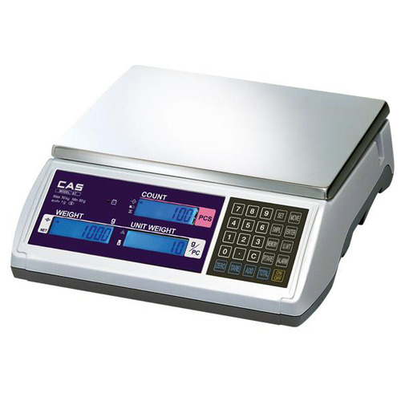

# CAS EC-15 Serial Reader

<p align="center">
  
</p>

CAS **EC-15 전자저울**의 RS-232 데이터를 USB-RS232 변환기를 통해 읽고, 안정 중량과 통신 상태를 ROS 2 topic으로 발행하는 Python / ROS 2 도구입니다.

이 repository 하나에서 다음을 확인할 수 있습니다.

- pySerial 기반 원본 serial 수신
- `NET` / `net` 안정 상태 구분
- ROS 2 `std_msgs/msg/Float64` 안정 중량 발행
- ROS 2 `std_msgs/msg/Bool` 저울 통신 상태 발행
- `/dev/cas_ec15` udev 별칭 설정

## Quick Start

이미 Python dependency와 udev 별칭 설정이 끝난 환경에서는 아래 순서로 바로 실행합니다.

```bash
cd ~/inpyo_ws/cas_ec15_pyserial
source /opt/ros/humble/setup.bash

colcon build --symlink-install
source install/setup.bash
ros2 run cas_ec15_pyserial ec15_weight_node
```

다른 terminal에서 중량 topic을 확인합니다.

```bash
cd ~/inpyo_ws/cas_ec15_pyserial
source /opt/ros/humble/setup.bash
source install/setup.bash

ros2 topic echo /weight_g
```

통신 상태는 다음 topic으로 확인합니다.

```bash
ros2 topic echo /scale_alive
```

처음 연결하거나 문제가 있는 경우에는 [설치 및 실행](docs/setup_and_run.md)을 처음부터 따라갑니다.

## ROS 2 Interface

| 항목 | 기본값 | 의미 |
|---|---|---|
| package | `cas_ec15_pyserial` | ROS 2 package |
| node | `ec15_weight_node` | 안정 중량 및 통신 상태 publisher |
| topic `weight_g` | `std_msgs/msg/Float64` | 안정 중량 [g] |
| topic `scale_alive` | `std_msgs/msg/Bool` | 최근 유효한 EC-15 중량 frame 수신 여부 |
| parameter `port` | `/dev/cas_ec15` | EC-15 serial port |
| parameter `baudrate` | `9600` | `2400`, `4800`, `9600` 중 하나 |
| parameter `data_timeout_sec` | `2.0` | 이 시간 동안 유효한 중량 frame이 없으면 `scale_alive=false` |

`weight_g`는 relative topic이므로 namespace 없이 실행하면 `/weight_g`가 됩니다. EC-15이 불안정 상태인 `net`을 출력하는 동안에는 새 중량 message를 발행하지 않습니다.

`scale_alive`도 relative topic이므로 namespace 없이 실행하면 `/scale_alive`가 됩니다. 이 값은 `NET` 또는 `net`으로 정상 parsing 가능한 EC-15 중량 frame이 `data_timeout_sec` 이내에 수신되었는지를 나타냅니다. 따라서 저울이 흔들려 `net` 상태여도 serial 데이터가 정상 수신되고 있으면 `scale_alive=true`입니다. malformed line이나 다른 형식의 serial 데이터는 통신 정상 판단에 사용하지 않습니다.

`data_timeout_sec`의 기본값 `2.0`초는 초기 운영값입니다. 실제 장비의 RS-232 출력 주기를 확인한 뒤 전체 Custom Food cycle에서 필요한 실패 감지 시간에 맞게 조정할 수 있습니다.

설치되는 executable은 다음과 같습니다.

```text
cas_ec15_pyserial ec15_reader
cas_ec15_pyserial ec15_udev_setup
cas_ec15_pyserial ec15_weight_node
```

## 문서

- [설치 및 실행](docs/setup_and_run.md): dependency, standalone serial 확인, ROS 2 build, udev 설정, 실행, 테스트, troubleshooting
- [하드웨어 설정](docs/hardware_setup.md): EC-15 통신 설정, RS-232 배선, USB-RS232 확인
- [EC 시리즈 사용자 매뉴얼](EC_KOR_UM.pdf): 제조사 사용자 매뉴얼 원본

## 프로젝트 구조

```text
cas_ec15_pyserial/
├── assets/
│   └── cas_ec15.jpg
├── cas_ec15_pyserial/
│   ├── __init__.py
│   ├── protocol.py          # EC-15 중량 문자열 parser
│   ├── ros2_node.py         # 안정 중량 및 통신 상태 ROS 2 publisher
│   └── udev_setup.py        # /dev/cas_ec15 udev rule 설정
├── docs/
│   ├── hardware_setup.md
│   └── setup_and_run.md
├── resource/
│   └── cas_ec15_pyserial
├── EC_KOR_UM.pdf
├── LICENSE
├── ec15_check.sh            # ROS 없이 serial 진단 환경 준비 및 실행
├── ec15_reader.py           # standalone serial 수신 확인 CLI
├── package.xml
├── requirements.txt
├── setup.cfg
├── setup.py
├── test_ec15_reader.py
└── test_udev_setup.py
```

`build/`, `install/`, `log/`, `.venv/`, `__pycache__/` 같은 로컬 생성물은 Git에 포함하지 않습니다.

## 요구 환경

- Ubuntu / Jetson Linux
- Python 3.10 이상 권장
- pySerial 3.5 이상
- ROS 2 Humble (ROS 2 adapter 사용 시)
- CAS EC-15
- USB-RS232 변환기

## License

MIT License. Copyright (c) 2026 Inpyo Lee.
